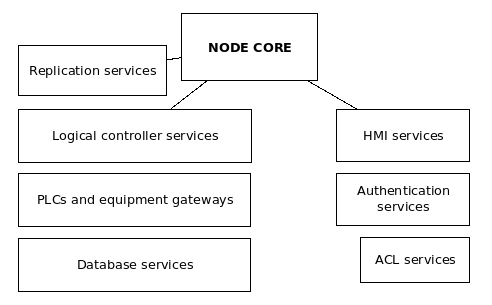

Platform architecture
*********************

.. contents::

Basics
======

Each EVA ICS v4 node has the following architecture:

* The core and all services are connected to the single inter-process
  communication bus, based on `ELBUS <https://elbus.bma.ai>`_ and using
  MessagePack as the payload serialization format.

* ELBUS is a high-speed industrial IPC bus, which can provide 100K+ RPC calls a
  second and 1M+ events a second without significant CPU load. ELBUS provides
  zero security in favor of speed and reliability, so all services/equipment in
  the local cluster must communicate via a private network only.

* The node server has the following services embedded:

    * **.broker** ELBUS broker service
    * **eva.core** the core service
    * **eva.launcher.** external service launchers
    * **eva.registry** the registry database service

* An external service is a local/remote process, connected to the node bus.

* External services are usually launched by "eva.launcher" services, which push
  initial configuration payloads, provide additional startup and watchdog
  functions. The external service processes can be launched manually.

* External equipment (such as custom hardware controllers) can be connected to
  the bus directly (if externals sockets are specified in "eva/config/elbus"
  registry key).

* Multiple EVA ICS nodes can be replicated with replication services.

* Authentication services are commonly used by HMI services only.

* HMI services provide web servers to host user-interface applications and
  HTTP/web socket API.

* When configured, service IDs should start from:

    * "eva.aaa.ID" - authentication and ACL services
    * "eva.hmi.ID" - HMI services
    * "eva.controller.ID" - controllers and gateways
    * "eva.db.ID" - database services
    * "eva.repl.ID" - replication services
    * "eva.svc.ID" - all other services
    

Primary external services
=========================

If :doc:`installed <install>` with "-a" argument, the following services are
created automatically:

* **eva.aaa.acl** ACL service
* **eva.aaa.localauth** Local authentication service (local users / API keys)
* **eva.hmi.default** The default HMI service (web UI and HTTP API)

Additional external services
============================

The following services are additionally provided by default:

* **controller-virtual** virtual controller service

* **db-influx** `Influx <https://www.influxdata.com>`_ databases service

* **db-sql** SQL databases service

* **svc-expiration** State expiration checker service (for timers and
  expire-on-fail)

Service management
==================

Create
------

If managed by EVA ICS launchers, a service can be created either:

* via "eva.core" bus RPC

* using :ref:`eva-shell` (svc create / svc deploy commands)

If deployed with eva-shell, the payload must have the following minimal format:

.. code:: yaml

    - id: SERVICE_ID
      params:
        command: # path to the service executable
        bus:
            path: var/elbus.ipc # for the local bus
        config:
            # service configuration

For the whole parameters, see bus RPC "svc.deploy" method of "eva.core".

Manage
------

Services provide bus RPC methods, methods "test" and "info" are mandatory.

If using :ref:`eva-shell`, service methods can be either assigned to dedicated
commands or be called directly with "svc call" command.

Service methods can be called via bus RPC directly, e.g.:

.. code:: bash

    /opt/eva4/sbin/elbus /opt/eva4/var/elbus.ipc rpc call eva.aaa.acl acl.list

If payload is required, it must be packed to MessagePack. A tool "bin/yml2mp"
can be used to convert YAML files to MessagePack from the command-line.

Destroy / undeploy / purge
--------------------------

Use either :ref:`eva-shell` or the corresponding bus RPC methods of "eva.core".
