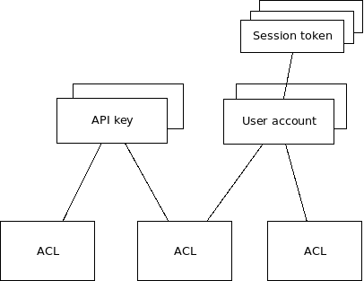

Authentication, authorization and accounting
********************************************

.. contents::

Basics
======

Local bus calls between EVA ICS services have zero security and authentication
in favor of speed and reliability, so all local services are considered as
trusted.

The following communications are considered as untrusted and require additional
authentication and authorization:

* External clients (such as web clients of :doc:`/svc/eva-hmi`)

* RPC calls and events between EVA ICS nodes (:doc:`/svc/eva-repl`).

Structure
=========

EVA ICS AAA model model looks as the following. There are no strict
requirements and any service layer can be replaced to a custom one, but in case
of significant incompatibility, all services above the custom layer must be
altered/patched/replaced.

Access control list
-------------------

Access control list are basic entities of EVA ICS AAA. ACLs are provided by
:doc:`svc/eva-aaa-acl`, which allows:

* ACL management

* Formatting ACL data according to the caller service needs, including
  combining multiple ACLs together.

The default ACL has the following structure:

.. code:: yaml

    id: <ACL_ID>
    admin: false
    read:
        items: ['oids']
        pvt: ['paths']
        rpvt: ['uris']
    write:
        items: ['oids']
    deny:
        items: ['oids']
        pvt: ['paths']
        rpvt: ['uris']
    ops:
        - log
        - supervisor
    meta:
        var: ['value']
        var2: ['value']

Fields:

* *admin* - admin ACL (has access to everything). In case if this field is set to
  *true*, all others (except *meta*) are ignored and not used for
  authorization.

* *read* grants read access to items/pvt/rpvt

* *write* grants read/write access to items

* *deny* denies access to certain items/pvt/rpvt, e.g. if read/write masks are
  used

* ops - list of special operations ("allow" in v3). supported values: *log*,
  *supervisor*

* meta - map of key=list fields, used for information purposes only

When two ACLs are combined, all fields are combined as well, including meta.

ACL can miss any field, the only mandatory field is "id".

Note that the default ACL service does not check all fields for errors (e.g.
field name misspelling), as they can be used by different HMI/replication
services. In case of an unsupported ACL, HMI/replication service may return an
error when applied.

API key
-------

API keys are used by certain services (such as :doc:`/svc/eva-hmi` and
replication ones) to authenticate RPC calls and encrypt certain types of
events.

Unlike similar products, API keys in EVA ICS are not connected with user
accounts, so there is not necessary to create so-called "service account
users".

By default, API key management and authentication are provided by
:doc:`svc/eva-aaa-localauth` service.

User
----

User accounts are used by certain services (such as :doc:`/svc/eva-hmi`) to
authenticate end-users. External RPC calls do not support user-based
authentication, so a user must first login with its account and then use the
obtained API token to authenticate all communications.

By default, API key management and authentication are provided by
:doc:`svc/eva-aaa-localauth` service.

Additional user authentication services available:

* :ref:`aaa.msad` - included in :doc:`/enterprise`.

Session token
-------------

Session tokens are provided by end-services (such as :doc:`/svc/eva-hmi`) to
authenticate external RPC calls and communications.

When a token is issued, an end-service caches assigned ACLs and authenticates
all further calls using them.

A token can expire or be destroyed by the end-service after the certain period
of time or by request from either the token owner or by admin via bus call.

A token MUST be automatically destroyed by the end-service if the user
account/ACLs it was formed on top, are modified or removed.
