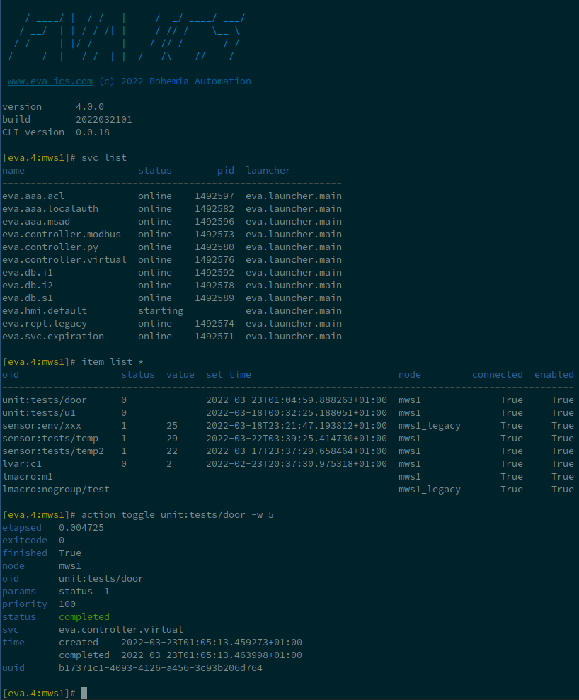

Command-line tools
******************

.. contents::

.. _eva-shell:

eva-shell
=========

The primary command-line tool to manage EVA ICS nodes is **eva-shell**, which
is either :doc:`installed <install>` automatically or can be added later, by
including "eva-shell" Python module in the Python virtual environment.

    with eva-shell, IoT management is a joy

EVA ICS v4 eva-shell can work in both command-line and interactive mode (type
"eva" without arguments to start it).

The interactive mode provides various features, like TAB-auto-completion,
command repetitions ("command \|T" or "command \|cT", where T is the command
interval, in seconds) etc.

Installing/updating
-------------------

eva-shell is not included into EVA ICS distribution any longer (but may be
installed automatically). To install/update it, either edit
"eva/config/python-venv" registry key, specify the desired version in "extra"
section (e.g. eva-shell>=1.0.0) and rebuild the Python virtual environment
(/opt/eva4/install/build-venv). Or execute:

.. code:: shell

    /opt/eva4/venv/bin/pip install -U eva-shell

The latest eva-shell version number can be obtained from
https://pypi.org/project/eva-shell/

Bus CLI
=======

Various calls to the EVA ICS core and services can be performed via `ELBUS
<https://elbus.bma.ai/>`_ with "sbin/elbus" command-line tool.

.. note::

    EVA ICS bus RPC uses MessagePack-packed payloads. To convert YAML to
    MessagePack, a provided tool "bin/yml2mp" can be used.

Registry management
===================

Command-line tools
------------------

* **bin/eva-registry** registry interactive/command-line tool (Python, installed
  automatically with eva-shell)

* **sbin/eva-registry-cli** registry command-line tool (included by default)

* **sbin/key-as-source** and **sbin/key-set-flag** wrappers around
  "eva-registry-cli" for certain tasks.
    
* **sbin/eva-edit-python-venv** edit Python virtual environment configuration.

Bus cheat-sheet
---------------

As the registry is based on `YEDB <https://yedb.bma.ai>`_, "eva.registry"
service accepts various calls via the bus.

Purge
~~~~~

To automatically purge the registry, e.g. after undeploying multiple items,
execute:

.. code:: shell

    /opt/eva4/sbin/elbus /opt/eva4/var/elbus.ipc rpc call eva.registry safe_purge

The same can be done with eva-shell:

.. code:: shell

    eva svc call eva.registry safe_purge

Temporary enable/disable auto-flush
~~~~~~~~~~~~~~~~~~~~~~~~~~~~~~~~~~~

To deploy multiple items, it may be useful to disable the registry auto-flush
feature:

.. code:: shell

    /opt/eva4/sbin/elbus /opt/eva4/var/elbus.ipc rpc call eva.registry server_set name=auto_flush value=false

The same can be done with eva-shell:

.. code:: shell

    eva svc call eva.registry server_set name=auto_flush value=false

