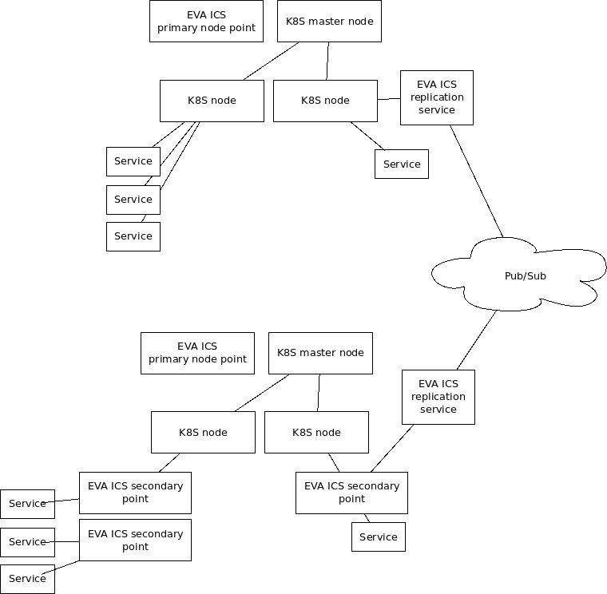

Using EVA ICS with Kubernetes (Draft)
*************************************

.. contents::

EVA ICS has got a :doc:`built-in node-scaling mechanism for heavy-loaded setups
</local_cluster>`. The built-in launchers start services, perform health-check
and allow service :doc:`deployment </iac>`.

However, in certain circumstances it may be useful to use
`https://kubernetes.io`_ as an additional platform for local service
management, which can provide additional high-availability mechanisms and
automatic resource load-balancing for huge local clusters.

Basics
======

EVA ICS node primary point is usually the only node, which hosts persistent
data (:doc:`/registry`). Others are deployed as micro-services, using either
built-in or an external orchestra management tools.

EVA ICS primary node point can be installed on the same physical or virtual
machine with the orchestra management master node or use a dedicated one. Both
EVA ICS primary node point and the orchestra management master node are
required to be online to have the local cluster available.

The figure below shows two acceptable strategies of using EVA ICS paired with
the orchestra management service, e.g. Kubernetes:

* The figure shows two clusters connected via EVA ICS replication service and
  Pub/Sub server.

* The upper cluster uses the native Kubernetes service management

* The lower cluster uses mixed service management, using Kubernetes and EVA ICS
  secondary points

* The internal service inter-connection is made via EVA ICS bus broker.

Native vs mixed
===============

Pros of native management:

* Allows to run every single service in a dedicated container

* Increased load-balancing capabilities

* Native Kubernetes application deployment

* The services can be managed with the native *kubectl* CLI tool or other
  Kubernetes management software

Cons of native management:

* Lacks cloud deployment features, services can be deployed on the local
  cluster only

* Weaker health-check mechanisms: EVA ICS does the native health-check using
  multiple ways, including internal bus calls. Kubernetes does the health-check
  by using either external command-line tools or monitoring open ports, which
  are usually not provided by automation workers.

Conclusion
==========

* It is recommended to use the native management in huge setups, which runs
  dozens of services with various and often unpredictable loads.

* It is recommended to use the mixed management in large setups, which run at
  least 10-20 services in total, to have automated resource management and
  additional high-availability.

* It is recommended to avoid orchestra management services for simple setups
  (less than 20 services per the local node), as EVA ICS in-house features make
  maintenance much more elementary.
