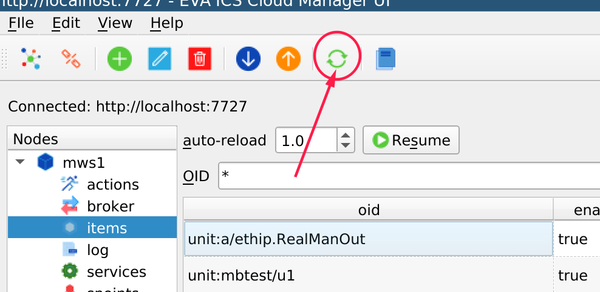
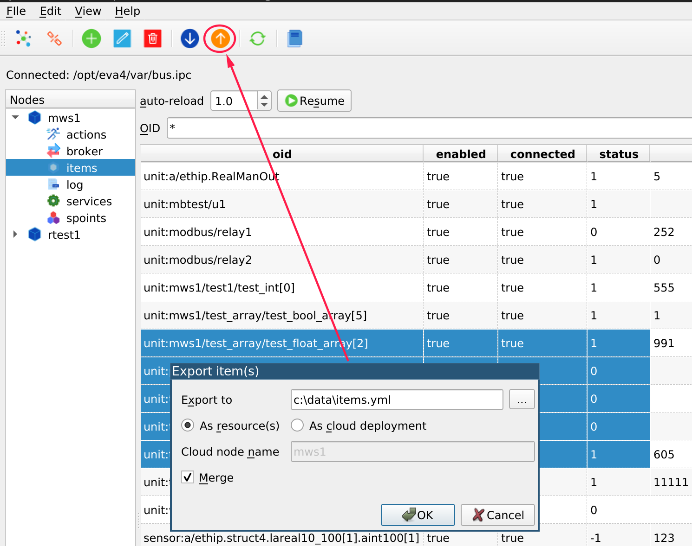

Common operations
*****************

.. contents::

Monitoring tables
=================

Data reloads
------------

All the tables automatically reload data from the node. When the cursor is put
into a table cell or sorting order is changed, the automatic reload is stopped.

The auto-reload can be resumed at any time, also the page can be reloaded
manually, using Ctrl+R shortcut or the corresponding tool bar button.

.. note::

    List of the available nodes can be reloaded with re-connect only.

Copying text
------------

Select a text from the monitoring table and press the button on the tool bar
(or Ctrl+C). The cell values will be copied to the system clipboard, divided
with tabs. After, the data can be inserted e.g. into a spreadsheet program for
the further analysis.

Adding a resource/item
======================

Certain tables, such as items and services, allow adding resources.

The newly added resource may not appear in the monitoring table until reloaded.

Editing resources/items
=======================

Certain tables, such as items and services, allow editing resources.

The new resource data may not appear in the monitoring table until reloaded.

Deleting resources/items
========================

Certain tables, such as items and services, allow destroying resources.

when clicked, the operation is performed on ALL selected resources/items.

Deleted resources may still appear in the monitoring table until reloaded.

Exporting resources/items
=========================

Certain tables, such as items and services, allow exporting resources.

when clicked, the operation is performed on ALL selected resources/items.

The resources can be exported as a resource payload file (YAML, e.g. for
:ref:`eva-shell` *item deploy* command) or as a payload for :doc:`/iac`.

.. warning::

    Remote node resources (items) can not be exported. When exporting items,
    always set "node" filter to the current chosen node to avoid remote items
    in the export list.

Importing resources/items
=========================

Certain tables, such as items and services, allow importing resources from
resource payload YAML files.

The imported resources may not appear in the monitoring table until reloaded.
