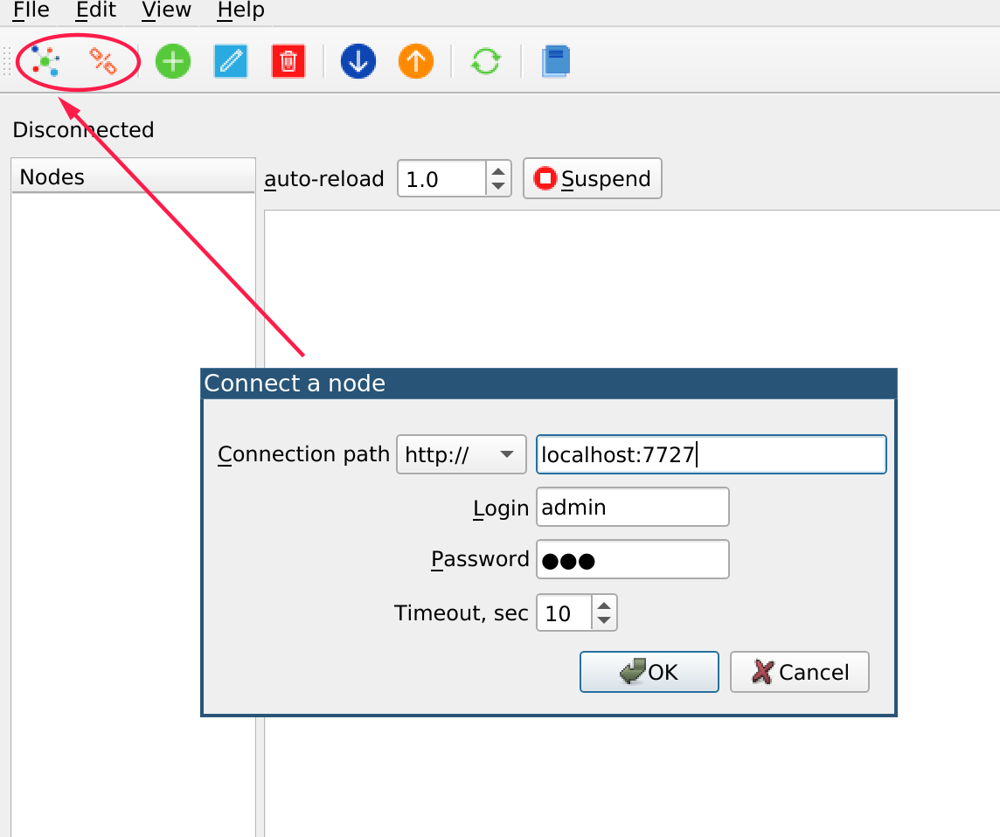

Connecting to a node
********************

.. contents::

Connection dialog
=================

When Cloud Manager UI is started, the connect window appears automatically:

To manage connection, use the marked connect/disconnect tool bar buttons.

Connection path
===============

The following connection modes are supported:

* **http/https** requires :doc:`/svc/eva-hmi` deployed and administrator user
  credentials.

* **rt** connects to a node via the local bus

HTTP/HTTPS
----------

Make sure :doc:`/svc/eva-hmi` service is deployed and running.

If there is no :doc:`administrator users </aaa>` on the node yet, create one,
e.g. with :ref:`eva-shell`:

.. code:: shell

    eva user create admin # type a password when prompted
    eva user edit admin

and modify user's ACLs as the following:

.. code:: yaml

    acls: ['admin']

The default connection path is *<IP/HOST>:7727*, the default protocol is
*http://*.

.. note::

    HTTP/HTTPS connector does not support redirects for security purposes. Make
    sure the URI is final.

Local bus (BUS/RT)
------------------

For the local host, specify the connection path as */opt/eva4/var/bus.ipc*, for
remote nodes, a bus TCP socket must be configured (see :ref:`config_bus`, no
credentials required).

Timeout
=======

The selected timeout must match the longest operating timeout. Consider e.g. if
heavy resource payloads are imported, the timeout must be increased to avoid
errors.
