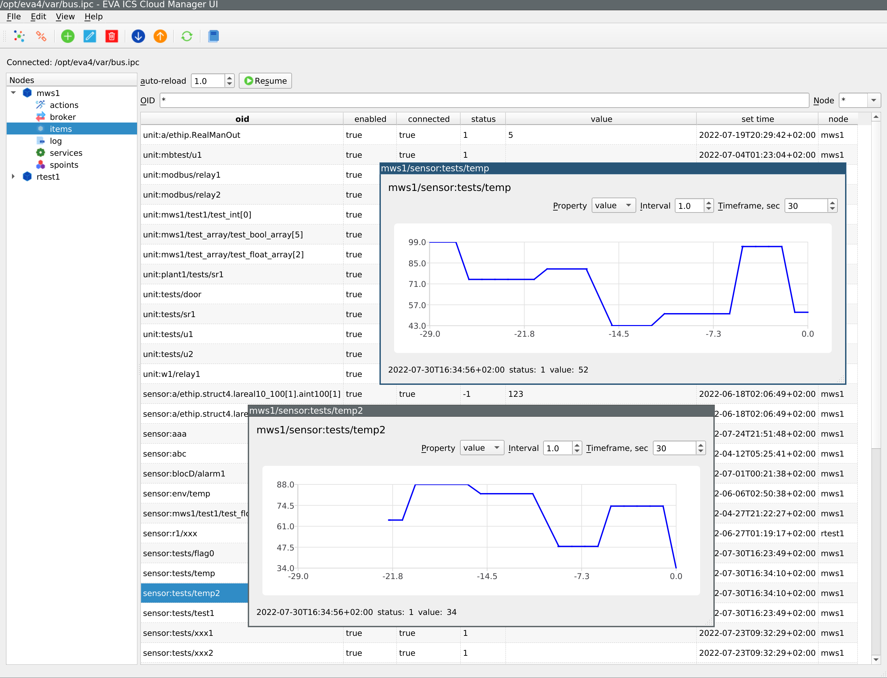

Cloud Manager UI
****************

.. contents::

EVA ICS Cloud Manager UI is a desktop dashboard application, which allows to
monitor and manage a remotely connected EVA ICS v4 node, as well as all other
:doc:`replicated nodes </svc/eva-repl>`, connected as managed (v4 only).

The application's goal is to provide an interactive cloud dashboard with
certain management functions. For complete management, refer to :doc:`/cli`.

Installation
============

Download a package from https://pub.bma.ai/ecmui/ , officially supported
operating systems are:

* Windows 10/11+ (download a *.msi* package)
* Ubuntu 20.04/22.04 (download a *.deb* package)

Windows 10/11+
--------------

Download a *.msi* package and follow the instructions.

Linux (Ubuntu 20.04/22.04)
--------------------------

Download a *.deb* package and install it with:

.. code:: shell

    apt install ./file.deb

For Gnome/KDE, an application shortcut is automatically created. For others,
run the application as:

.. code:: shell

    ecmui

Other operating systems
-----------------------

Cloud Manager UI is an open-source application and can be built from source for
almost any Linux distribution, macOS X and other.

`Install Rust <https://www.rust-lang.org/tools/install>`_, download the source
from https://github.com/eva-ics/ecmui and compile:

.. code:: shell

    git clone https://github.com/eva-ics/ecmui
    make prepare # deb-based Linux systems only
    cargo build --release

Operating manual
================

.. toctree::

    connect
    common
    actions
    broker
    items
    log
    services
    spoints
