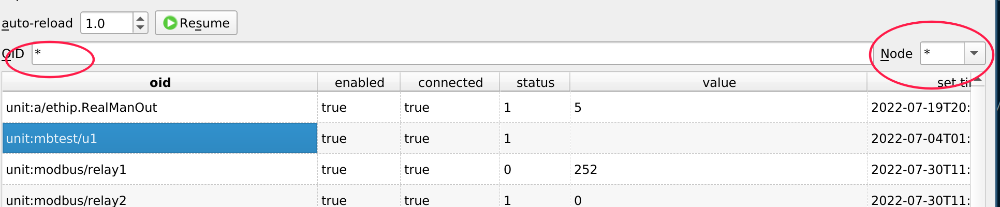
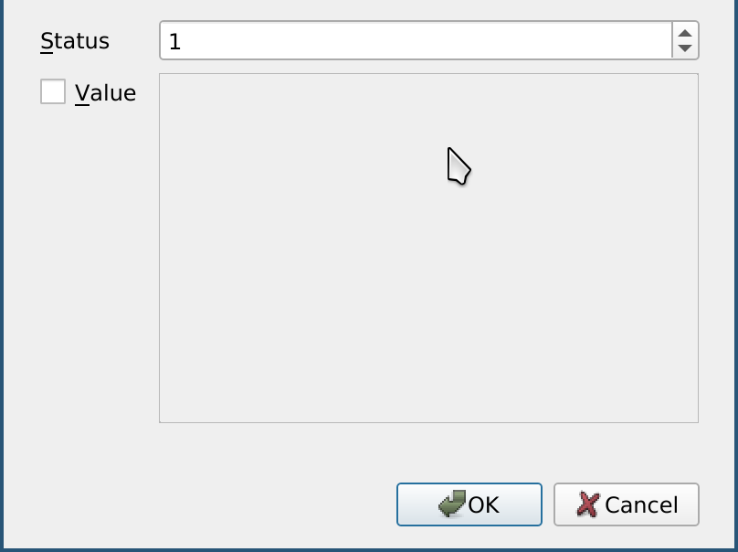
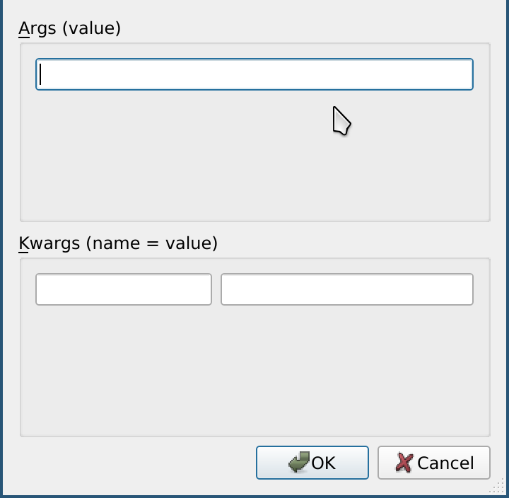
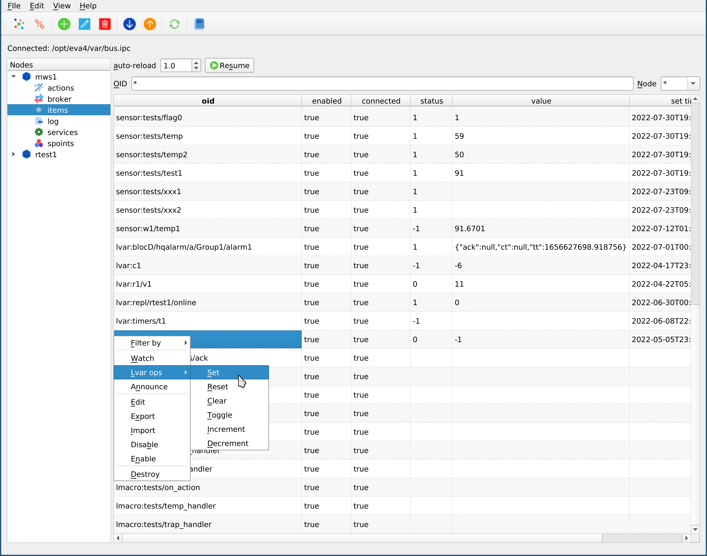
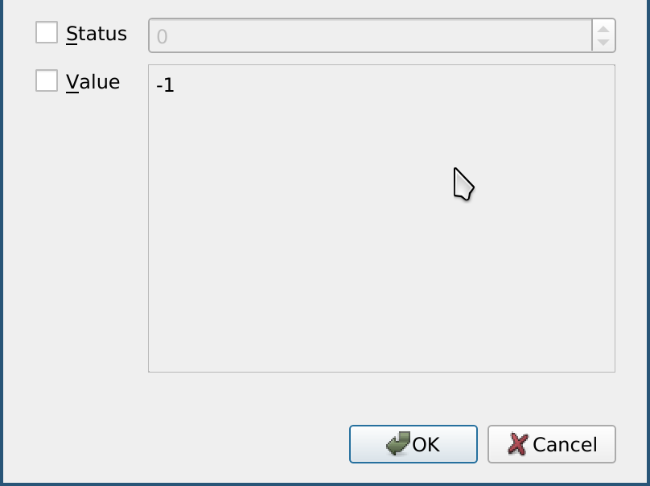
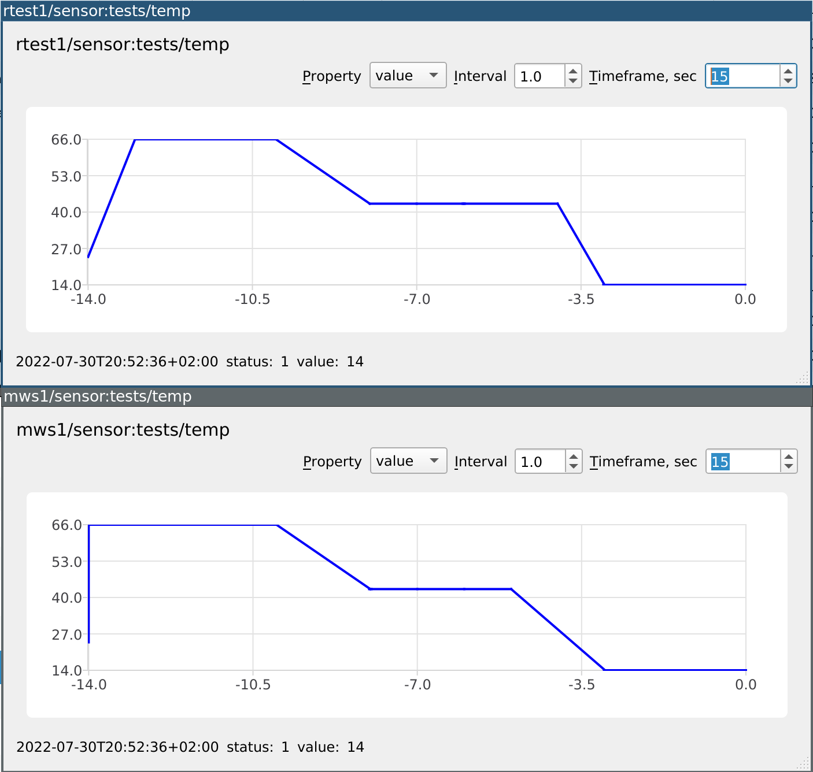

Items
*****

The page monitors EVA ICS :doc:`items </items>`.

.. contents::

Displaying items
================

By default, the monitoring table is empty, as the node may contain millions of
items. Enter item OID or mask (MQTT-style wildcard, e.g. sensor:group/#) in the
filter field and reload the table (or wait for the auto-reload).

.. note::

    For heavy-loaded nodes it is highly recommended to stop auto-reload before
    entering the mask

Unit actions
============

To start a :ref:`unit` action, right-click a unit in the monitoring table and
select "Action" or "Action toggle".

If the value check-box is not checked, the action is executed with status
parameter only.

Running lmacros
===============

To run a :ref:`lmacro`, right click a lmacro in the monitoring table and select
"Run".

Lvar operations
===============

Lvar set
--------

To set a :ref:`lvar` value, right-click lvar in the monitoring table and select
"Lvar ops -> Set"

Other lvar operations
---------------------

Lvar operations "reset", "clear", "toggle", "increment" and "decrement" are
performed on all lvars selected in the monitoring table.

Watching item states
====================

Right-click on an item with state (:ref:`unit`, :ref:`sensor` or :ref:`lvar`)
and select "Watch".

An item watch dialog will be opened. The application can watch multiple items
at once as well.

Watching item state is useful when performing setup tasks, monitoring the
system stability.

Opening the same item on multiple nodes allows to monitor :doc:`node
replication </svc/eva-repl>`.
