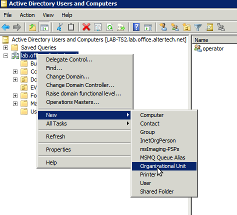
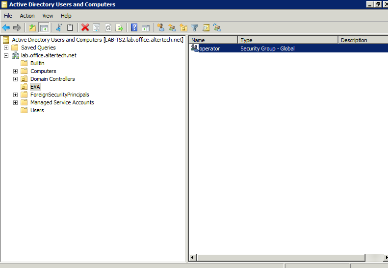

Enterprise version
******************

.. contents::

General terms and conditions
============================

The default EVA ICS v4 Enterprise pack includes the following extensions:

* EVA JS Framework WASM extension (single node)
* Active Directory authentication service (single node)
* PubSubRT Enterprise (up to two PubSubRT nodes in cluster)

The default Enterprise pack can be obtained from `EVA ICS representatives
<https://www.eva-ics.com/contacts>`_.

* The default Enterprise pack costs 2,000 EUR/year and includes 10 hours of
  support from the EVA ICS core team.

* The Enterprise extensions may be provided for free or with a discount for
  customers who regularly spend certain amount of funds on support contracts.
  Please contact your representative for details.

EVA JS Framework WASM extension
===============================

`WASM <https://webassembly.org>`_ extension for `EVA JS Framework
<https://github.com/alttch/eva-js-framework/>`_ offloads state processing from
the web browser JavaScript engine to the WASM application, allowing SCADA HMI
to monitor hundreds of items without any client device overhead.

According to tests, EVA JS Framework with WASM extension is about 20x times
faster, than in regular mode.

Installation
------------

* Obtain WASM extension from a `EVA ICS representative
  <https://www.eva-ics.com/contacts>`_.

* The extension requires EVA JS Framework version 0.3.25 or above.

* Unpack *evajw-XXXX.tgz* archive into the directory where EVA JS Framework is
  installed. E.g. if the framework is installed in */opt/eva/ui*, the module
  should be placed in */opt/eva/ui/evajw*.

* (Recommended). Make sure the *wasm* MIME type is set to "application/wasm" in
  EVA ICS HMI service.

* Put the following code in your HMI, before starting the web-HMI application
  or EVA JS Framework:

.. code:: javascript

    $eva.wasm = true;

* The WASM module will be automatically loaded at framework start.

* If the module is not available, the error message will be displayed in the
  JavaScript development console, as well in the web browser and HMI will be
  stopped.

* If the module license is not valid for the current domain or expired, the
  error message is displayed in JavaScript development console plus an alert
  and the framework automatically switches itself to the regular mode.

* To make sure the WASM module works fine, enable debug mode in EVA JS
  Framework:

.. code:: javascript

    $eva.debug = true;

* When debug mode is enabled, events processed by the WASM extension are
  prefixed with "W" (e.g. *EVA::Wws state* instead of a regular *EVA::ws
  state*).

* Also, the method *get_mode* returns current framework mode:

.. code:: javascript

    $eva.get_mode(); // "js" for regular, "wasm" for WASM extension

Licensing
---------

* The WASM extension is licensed for the specified customers' domains and can
  not be used on others. If a user requires accessing web-HMI via IP address,
  it should be added in the license as well.

* The license is built-in into the copy of the WASM extension, owned by the
  customer.

* The license may have expiration time or be perpetual.

* To check the license expiration time manually, the following function can be
  used:

.. code:: javascript

    evajw.get_license_expiration(); // returns either null or the license
                                    // expiration timestamp

* The list of domains/IP addresses is encrypted and can not be read.

Limitations
-----------

* The WASM extension does not support calling the *unwatch* method for the
  particular handler function. Watch can be cleared by *oid* or globally only.

* OID masks do not support internal wildcards (e.g. "sensor:\*/test")

Active Directory authentication service (single node)
=====================================================

The service provides authentication against Active Directory.

Setup
-----

Upload the provided binary on the EVA ICS node server, use the following
configuration template:

.. literalinclude:: svc-tpl/svc-tpl-aaa-msad.yml
    :language: yaml

and create the service using :doc:`eva-shell <cli>`:

.. code:: shell

    eva svc create eva.aaa.msad path/to/tpl.yml

Edit the HMI service (e.g. "eva.hmi.default") and add the additional
authentication service provider into "auth_svcs" section:

.. code:: shell

    eva svc edit eva.hmi.default

.. code:: yaml

    auth_svcs:
        - eva.aaa.localauth
        - eva.aaa.msad

The above configuration will try to authenticate users against local accounts
and switch to Active Directory if no local account exits. To authenticate
against Active Directory accounts first, change the order of the authentication
services.

.. note::

    The service can be deployed multiple times with different configs to
    support e.g. non-standard Active Directory federation setups.

Active Directory configuration
------------------------------

Log into the Active Directory domain controller, open *Active Directory Users
and Computers* and create an organizational unit (default - *EVA*)

Create security groups inside the organizational unit. Group names must match
IDs of EVA ICS ACLs:

Assign a security group to a domain user. If multiple security groups are
assigned, a combined ACL is created. If the required ACL ID does not exist,
authentications attempts are considered as failed, despite the user may have
additional existing ACLs assigned.

Usage
-----

Authentication
~~~~~~~~~~~~~~

After OU security group is assigned to Active Directory user, its credentials
can be immediately used for authentication in EVA ICS. It is not necessary to
create a local user in local authentication services.

Users can authenticate themselves either with "login" or with "login\@domain".

If "default_domain" option is specified in the configuration, users can omit
domains in their logins and the default domain is used for authentication.

.. note::

    For cached credentials, "user" and "user\@domain" are two different users.
    If such behavior leads to a logical confusion for 3rd party software or UI
    apps, disable "default_domain" option in the configuration.

If "default_domain" option is not specified, users MUST always specify a domain
in their logins.

ACL prefixes
------------

If *acl_prefix* is specified in the service configuration, it will look for ACL
with id *{acl_prefix}{AD security group}*, e.g.

* acl_prefix = msad\_

* user has assigned security group EVA/operator

* The EVA ICS ACL must have id *msad_operator*

PubSubRT Enterprise
===================

PubSubRT Enterprise is the cluster-enabled version of `PubSubRT
<https://github.com/alttch/psrt/>`_ server, recommended for large
industrial/enterprise setups.

Packages for Debian, Ubuntu and other deb-compatible Linux distributions can be
downloaded at https://pub.bma.ai/psrt-enterprise/

PubSubRT Enterprise can be used in "unlimited trial" mode. More info and setup
instructions can be found at https://github.com/alttch/psrt/#enterprise-version
