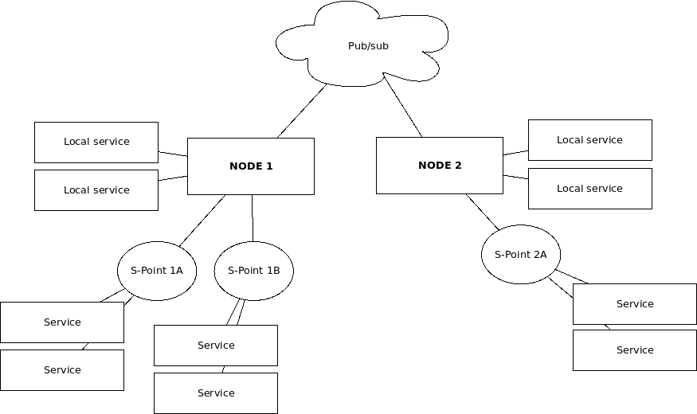

Local clustering and secondary points
*************************************

.. contents::

Basics
======

A EVA ICS node can be split into the primary and secondary points.

The secondary points contain service launchers, which allow moving heavy-loaded
services to additional machines. Also, secondary points can be used for
high-availability of certain types of services (e.g. :doc:`/svc/eva-hmi`).

Architecture
============

When a secondary point is connected, it creates two bus instances:

* **eva.spoint.<NAME>** for system communications
* **eva.launcher.<NAME>** for service launching

The launchers get all required information from the primary point, where EVA
ICS core is located, so secondary points can not launch services until
connected.

When a s-point gets connected, it asks the core to launch all services assigned
to it.

When the primary point is shut down, all secondaries enter the waiting mode and
attempt to reconnect every 1 second.

Secondary points do not host inventory, registry or any kind of resources and
can be easily dropped at any time. Certain services may host their data in
EVA_DIR/runtime folder at a secondary point.

Secondary points also do not have any logs, all messages are sent and logged by
the primary point.

Configuration
=============

* To prepare a node to act as the local cluster primary point, edit
  :ref:`config_bus` key:

.. code:: shell

    eva edit config/bus
    # or
    /opt/eva4/sbin/eva-registry-cli edit eva/config/bus

in the section "sockets" append a network socket to listen on, e.g.
"0.0.0.0:7777":

.. code:: yaml

    # ....
    sockets:
        - var/bus.ipc # KEEP THIS
        - "0.0.0.0:7777"

As the bus sockets provide very minimal security, it is highly recommended to
host both the primary and the secondary points in a trusted network and use
VPN/firewall for network-to-network communications.

Restart the primary s-point:

.. code::

    eva server restart
    # or
    /opt/eva4/sbin/eva-control restart

* :doc:`Install <install>` EVA ICS on a secondary point machine.

* Edit :ref:`eva_config` and set the following:

.. code:: shell

    MODE=spoint
    ARGS="--connection-path your_ip_or_host:7777"

* Restart the secondary point

* The point should appear in the list:

.. code:: shell

    eva spoint list
    # or
    /opt/eva4/sbin/bus rpc call eva.core spoint.list

Moving services to secondary points
===================================

Edit/deploy/re-deploy a service, with an additional parameter:

.. code:: yaml

    launcher: eva.launcher.<NAME>

As soon as the service configuration is modified, it is stopped at the primary
point and launched on the secondary.

For services, not included in the default EVA ICS distribution, make sure they
are installed on the secondary point machine.
