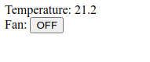

Quick start
***********

.. contents::

Few words from the authors
==========================

Thank you for being interested in EVA ICS! Our goal is to make EVA ICS the
world-fastest, the most reliable, flexible, modern and easy-to use cloud-SCADA.

If you are looking for industrial automation solution, we are sure that EVA ICS
perfectly fits your needs.

If you are looking for SOHO or light-industry automation solution, EVA ICS may
be a bit complicated for you and contain lots of boring "unnecessary" stuff,
but you will definitely evaluate it positively if your setup start growing.

To quickly summarize, here is the difference between industrial SCADAs and
SOHO-automation systems:

===============  ===================================  ====================================
Features         SOHO automation                      Industrial automation
===============  ===================================  ====================================
Protocols        | ZigBee, Z-Wave etc., a little of   | Modbus, SNMP, 1-Wire, TwinCat ADS,
                 | SNMP, Modbus & 1-Wire              | Ethernet/IP etc.
Focused on       | Simplicity, user-friendliness      | Speed, amounts of data, scaling
                                                      | and reliability
Logic            Application (majority of)            Fieldbus PLCs (majority of)
Security and QA  Basic                                Enterprise-grade
Support          Basic/community                      Enterprise-grade
===============  ===================================  ====================================

We are `Bohemia Automation <https://www.bohemia-automation.com>`_ / `Altertech
<https://www.altertech.com/>`_, a group of companies with 15+ years of
experience in the enterprise automation and industrial IoT. Our setups include
power plants, factories and urban infrastructure. Largest of them have 1M+
sensors and controlled devices and the bar raises higher and higher every day.

Installation
============

Get `any supported Linux distro <https://www.eva-ics.com/download>`_. And
:doc:`install </install>` EVA ICS v4 with the default settings plus HMI
service.

Execute all commands in this tutorial under the super-user (root). By default,
EVA ICS starts the node core as root, however privileges of services are
dropped to restricted users after being launched.

.. code:: bash

    sudo -s
    curl https://pub.bma.ai/eva/install | sh /dev/stdin -a --hmi

The above command prepares the system, installs all EVA ICS components (default
distribution, :ref:`eva-shell`) on a single machine to "/opt/eva4" directory
and automatically deploys basic services.

Additionally, Python in installed and the virtual environment is created at
*/opt/eva4/venv*. Python is required for :ref:`eva-shell` and some other
services.

"eva" command is automatically added into the system path with the symbolic
link in */usr/local/bin*.

The task
========

Let us have a temperature sensor and a fan, both connected with Modbus to the
local serial port. We want to:

* Monitor state of both and control the fan from UI

* Turn the fan on when the temperature reaches 25C.

* Turn the fan off when the temperature reaches 22C (3C hysteresis)

Usually the above logic is controlled by a PLC, while SCADA software just
collects, monitors and controls its registers, but in this example we will
offload it into the application side.

Commons
=======

In EVA ICS the node core is responsible only for data brokering with very
minimal logic, all functionality is provided by :doc:`services <default_svcs>`
(see :doc:`architecture`).

There are two ways configuring the node:

* creating/deploying :doc:`items <items>`, services and other resources
  one-by-one.

* :doc:`deploy<iac>` everything with a single deployment file from a local or
  remote node.

In this tutorial, we will create elements one-by-one, while at the end the full
deployment file will be provided as well.

The elements can be created either with :ref:`eva-shell` or with direct bus
calls to the node core, using "/opt/eva4/sbin/bus" command-line utility. In
this example we will use eva shell only.

Connecting the equipment
========================

Creating items
--------------

Create the items. There following two types of items are required: :ref:`unit`
(can be controlled) and :ref:`sensor` (can be monitored only).

It is preferred to use :ref:`eva-shell` in the interactive mode (run "eva"
without arguments) to get auto-completion and other features, but in this
tutorial we will send commands one-by-one directly from the system shell.

.. code:: shell

    eva item create sensor:room1/temp
    eva item create unit:room1/fan

There is no extra configuration required for the sensor, but unit actions must
be mapped to a service. Edit the unit:

.. code:: shell

    eva item edit unit:room1/fan

and modify its configuration to the following:

.. code:: yaml

    enabled: true
    oid: unit:room1/fan
    action:
      svc: eva.controller.modbus1

Both created items can receive state updates from any service, while the unit
action is mapped to the service *eva.controller.modbus1*.

EVA ICS :doc:`items </items>` have two state registers: status (i16) and value
(Any). The status -1 means that the item is in error-state.

Units use the status register for basic states (ON=1/OFF=0, OPEN=1/CLOSED=0
etc.) having the value register either unused or mapped to advanced properties
(e.g. for a motor = speed).

Sensors usually do not use status register (unless they are in error-state)
having its always = 1 and telemetry written in the value register.

For some setups units may have the same approach: status=1 means OK and
status=-1 means error, while the value register is used to keep/set unit state
with actions. This way is recommended if majority of logic is handled by
fieldbus PLCs.

Let us read the item states:

.. code:: shell

    eva item state \*

*unit:room1/fan* has status=0 (OFF), *sensor:room1/temp* has status=1 (OK),
both have null in the value register.

In our example, we will use *unit:room1/fan* status register only (fan is on -
status=1, off - status=0).

Fieldbus connection
-------------------

:doc:`/svc/eva-controller-modbus` is one of the default services, so it is
already installed on the machine.

Let us create its instance from the template and call it
*eva.controller.modbus1*:

.. code:: shell

    eva svc create eva.controller.modbus1 \
        /opt/eva4/share/svc-tpl/svc-tpl-controller-modbus.yml

When executed, the configuration editor is automatically opened.

Consider the fan control relay is at Modbus unit 0x01 and is controlled by coil
#0 and the temperature sensor is at Modbus unit 0x02 and its value is stored in
holding registers h0-h1 as IEEE 754a 32-bit float.

Modbus is at */dev/ttyS0* (system RS-232 port #1), communicated with RTU serial
protocol.

Modify the configuration to the following, more info in the configuration
comments:

.. code:: yaml

    - id: eva.controller.modbus1
      params:
        bus:
          path: var/bus.ipc # the default local node event bus
        # service command, absolute or relative to EVA_DIR
        command: svc/eva-controller-modbus
        config:
          modbus:
            path: /dev/ttyS0:9600:8:N:1
            protocol: rtu
          # there are no batch-read commands in Modbus for mixed registers, so
          # data is always pulled in blocks and parsed after
          pull:
          # the first block: modbus unit 1, register C0, pulling the single register
          - count: 1
            reg: c0
            unit: 1
            map:
            # block mapping: coil at the offset 0 is mapped to unit:room1/fan status
            - offset: 0
              oid: unit:room1/fan
              prop: status
          # the second block: modbus unit 2, register H0, pulling 2 registers
          - count: 2
            reg: h0
            unit: 2
            map:
            # block mapping: real (32-bit IEEE 754 float) at offset 0
            # is mapped to sensor:room1/temp value (no prop field is required)
            - offset: 0
              oid: sensor:room1/temp
              type: real
          # do not send events to the core for 3600 seconds if the state is not modified
          pull_cache_sec: 3600
          # pull both Modbus units every 200ms
          pull_interval: 0.2
          # action mapping: when there is an action on unit:room1/fan called,
          # set C0 at Modbus unit 1 to the requested status, the value register
          # is ignored
          #
          # if the action is completed, the item unit:room1/fan gets its new status during
          # the next pull cycle
          action_map:
            unit:room1/fan:
              status:
                reg: c0
                unit: 1
          # queue size for unit actions
          action_queue_size: 32
          # verify (read back) the Modbus register after it was modified during the action
          actions_verify: true
          # the service will panic if Modbus connection is not available (e.g.
          # serial port error)
          panic_in: 0
          # bus events queue size
          queue_size: 32768
          # if any operation fails - perform N retry attempts
          retries: 2
        # the service supports react-to-fail mode. This means on critical
        # errors it is started in the fail mode and sets status of ALL items,
        # mapped in "pull" sections to -1 (error)
        react_to_fail: true
        timeout:
          # for fieldbus services, set startup timeout a little higher than the
          # core timeout (default: 5 sec) to give them a time to connect to the
          # fieldbus and perform initial tasks
          startup: 10.0
        user: eva # for RTU, make sure the system user has access to /dev/ttyS0
        workers: 1

Check the service status:

.. code:: shell

    eva svc list

If any problems occur, check the logs in /opt/eva/log or execute:

.. code::

    eva log get -y

Consider, everything is okay, check the sensor state:

.. code:: shell

    eva item state sensor:*

Check the unit state:

.. code:: shell

    eva item state unit:*

Turn on / off the fan manually, "-w 5" means wait 5 seconds for the action
finish, otherwise obtain its uuid and keep running in the background:

.. code:: shell
    
    eva action toggle unit:room1/fan -w 5

Check the fan (visually and the unit status)

.. code:: shell

    eva item state unit:*

Defining logic
==============

As already mentioned, real-life plants usually have logic tasks performed by
fieldbus PLCs. However, in our example the logic is offloaded to the
application layer.

Rules
-----

EVA ICS v4 provides the default service :doc:`/svc/eva-controller-lm`, which
can handle basic logic tasks, such as rules, cycles and scheduled jobs.

Let us create a service instance and define required logic rules:

.. code:: shell

    eva svc create eva.controller.lm1 \
        /opt/eva4/share/svc-tpl/svc-tpl-controller-lm.yml

.. code:: yaml

    - id: eva.controller.lm.room1
      params:
        command: svc/eva-controller-lm
        bus:
          path: var/bus.ipc
        config:
          rules:
            - id: ROOM1_TEMP_ABOVE
              oid: sensor:room1/temp
              prop: value
              # matches if sensor:room1/temp value > 25
              condition:
                min: 25
              run: lmacro:room1/room1.fan_control
              args:
                - 1
            - id: ROOM1_TEMP_BELOW
              oid: sensor:room1/temp
              prop: value
              # matches if sensor:room1/temp value < 22
              condition:
                max: 22
              run: lmacro:room1/room1.fan_control
              args:
                - 0
        user: nobody # no privileged user required

Check the service status:

.. code:: shell

    eva svc list

Logic macros
------------

What does "run" field mean? It tells the controller to run a :ref:`lmacro` when
a rule condition matches. Logic macros are similar to PLC programs, which are
executed either cyclically or on events. The primary difference is that lmacro
can be written in any supported programming language and physically hosted on
any EVA ICS node in the cloud. Some lmacro scenarios can be embedded in custom
services as well.

Deploying lmacro controller
~~~~~~~~~~~~~~~~~~~~~~~~~~~

We will write a simple Python logic macro, which will be handled by
:doc:`/svc/eva4-svc-controller-py`. This service is not included in the default
EVA ICS distribution as requires Python plus additional modules. Let us install
it first:

.. code:: shell
    
    /opt/eva4/sbin/venvmgr add eva4-controller-py

Create a service instance with the default configuration:

.. code:: shell

	eva svc create eva.controller.py \
		 /opt/eva4/share/svc-tpl/svc-tpl-controller-py.yml

.. code:: yaml

	- id: eva.controller.py
	  params:
		command: venv/bin/eva4-svc-controller-py
		bus:
		  path: var/bus.ipc
		config: {}
		user: nobody

Check the service status:

.. code:: shell

    eva svc list

Create logic macro
~~~~~~~~~~~~~~~~~~

Before dropping privileges to "nobody" the service automatically creates the
folder (default) */opt/eva4/runtime/xc/py* (*/opt/eva4/runtime/xc* is symlinked
as */opt/eva4/xc*) where Python scenarios must be put.

The scenarios can be edited with :ref:`eva-shell` as well. When edited with eva
shell, the scenario is also automatically checked for syntax errors.

:doc:`/svc/eva4-svc-controller-py` looks for scenario files using lmacro id,
not group+id, so let us create the file called *room1.fan_control.py*:

.. code:: shell

	eva edit xc/py/room1.fan_control.py

.. code:: python

	if _1 == 0:
		stop('unit:room1/fan')
	elif _1 == 1:
		start('unit:room1/fan')

The "_1" variable contains the first non-keyword argument, sent by the logic
manager.

The node core does not know yet that the :ref:`lmacro`
*lmacro:room1/room1.fan_control* is handled by *eva.controller.py* service. Let
us create it and assign action:

.. code:: shell

	eva item create lmacro:room1/room1.fan_control
	eva item edit lmacro:room1/room1.fan_control

.. code:: yaml

	enabled: true
	oid: lmacro:room1/room1.fan_control
	action:
	  svc: eva.controller.py

Now everything is mapped correctly. Check the lmacro, by manually running it:

.. code:: shell

	eva action run lmacro:room1/room1.fan_control -a 1 -w 5
	eva item state unit # the fan must be ON
	eva action run lmacro:room1/room1.fan_control -a 0 -w 5
	eva item state unit # the fan must be OFF

That is it. When the sensor temperature is changed, the scenario is executed
automatically. Both :ref:`unit` and :ref:`lmacro` action results can be
obtained at any time with the command:

.. code:: shell

	eva action list

Building Human-Machine Interface
================================

Interfaces and combined HTTP API for 3rd-party applications in EVA ICS v4 can
be provided by the default :doc:`/svc/eva-hmi`.

Creating users and ACLs
-----------------------

As we launched the installer with "--hmi" argument, the HMI service, as well as
required :doc:`authentication </aaa>` services were deployed automatically.

By default, EVA ICS creates "operator" ACL and "operator" user, but let us
create a new ACL, a new user and use them instead:

.. code:: shell

    eva acl create op
    eva acl edit op

.. code:: yaml

    id: op
    read:
      items:
      - '#'
      pvt:
      - '#'
      rpvt:
      - '#'
    write:
      items:
      - '#'

.. code:: shell

    eva user create op # set the password to 123
    eva user edit op

.. code:: yaml

    acls:
    - op
    login: op
    password: a665a45920422f9d417e4867efdc4fb8a04a1f3fff1fa07e998e86f7f7a27ae3

Install `EVA JS Framework <https://github.com/alttch/eva-js-framework>`_:

.. code:: shell

    curl -L \
        https://github.com/alttch/eva-js-framework/releases/download/v0.3.35/eva.framework.min.js \
        -o /opt/eva4/ui/eva.framework.min.js

Put the following HTML into */opt/eva4/ui/index.html*. Any JavaScript front-end
interface library can be used, but in this example we will use pure vanilla JS
only. There is no login prompt, the credentials are hard-coded directly:

.. code:: html

    <html>
    <head>
        <title>My first cool EVA ICS HMI</title>
        
    </head>
    <body>
        
Temperature: 

        
Fan:
            <input id="fan" type="button"
                onclick="$eva.call('action.toggle', 'unit:room1/fan')" />

        
    </body>
    </html>

Note that after calling fan actions, the HMI app does not need to update the
button value. The value is updated in real-time by "$eva.watch" as soon as the
server reports a new state.

Open http://localhost:7727 (or IP of your system) and HMI application is ready
to go:

That is all. After understanding this simple example, read other sections of
EVA ICS documentation to discover the real power of this mighty open-source
Industry-4.0 automation platform. Good luck!

The same but with deployment
============================

The above example is good for small or test setups. However, large setups
require :doc:`IaC </iac>` approach. Let us repeat everything with a single
deployment file.

.. note::

    Certain sections of the deployment file can be exported from a live system,
    using "eva item export", "eva acl export", "eva svc export" and related
    commands.

Make a fresh install and append additional services:

.. code:: shell
    
    sudo -s
    curl https://pub.bma.ai/eva/install | sh /dev/stdin -a --hmi
    /opt/eva4/sbin/venvmgr add eva4-controller-py
    # allow deployment for UI files
    ln -sf /opt/eva4/ui /opt/eva4/runtime/ui

Create a deployment file. As both lmacro code and HMI app are text-only, let us
include their content directly inside the file:

.. code:: yaml

    version: 4
    content:
      # ".local" is the alias for the local node
      # the deployment can be peformed on any managed node in the cloud
      # (if admin_key_id is set for the node in the replication service)
      - node: .local
        items:
          - oid: sensor:room1/temp
          - oid: unit:room1/fan
            action:
              svc: eva.controller.modbus1
          - oid: lmacro:room1/room1.fan_control
            action:
              svc: eva.controller.py
        svcs:
          - id: eva.controller.modbus1
            params:
              bus:
                path: var/bus.ipc # the default local node event bus
              command: svc/eva-controller-modbus
              config:
                modbus:
                  path: /dev/ttyS0:9600:8:N:1
                  protocol: rtu
                pull:
                - count: 1
                  reg: c0
                  unit: 1
                  map:
                  - offset: 0
                    oid: unit:room1/fan
                    prop: status
                - count: 2
                  reg: h0
                  unit: 2
                  map:
                  - offset: 0
                    oid: sensor:room1/temp
                    type: real
                pull_cache_sec: 3600
                pull_interval: 0.2
                action_map:
                  unit:room1/fan:
                    status:
                      reg: c0
                      unit: 1
                action_queue_size: 32
                actions_verify: true
                panic_in: 0
                queue_size: 32768
                retries: 2
              react_to_fail: true
              timeout:
                startup: 10.0
              user: eva
              workers: 1
          - id: eva.controller.lm.room1
            params:
              command: svc/eva-controller-lm
              bus:
                path: var/bus.ipc
              config:
                rules:
                  - id: ROOM1_TEMP_ABOVE
                    oid: sensor:room1/temp
                    prop: value
                    condition:
                      min: 25
                    run: lmacro:room1/room1.fan_control
                    args:
                      - 1
                  - id: ROOM1_TEMP_BELOW
                    oid: sensor:room1/temp
                    prop: value
                    condition:
                      max: 22
                    run: lmacro:room1/room1.fan_control
                    args:
                      - 0
              user: nobody
          - id: eva.controller.py
            params:
                  command: venv/bin/eva4-svc-controller-py
                  bus:
                    path: var/bus.ipc
                  config: {}
                  user: nobody
        acls:
          - id: op
            read:
              items:
              - '#'
              pvt:
              - '#'
              rpvt:
              - '#'
            write:
              items:
              - '#'
        users:
          - login: op
            # sha256-hashed
            # to generate: "echo -n 123 | sha256sum"
            password: a665a45920422f9d417e4867efdc4fb8a04a1f3fff1fa07e998e86f7f7a27ae3
            acls:
              - op
        upload:
          - src: https://github.com/alttch/eva-js-framework/releases/download/v0.3.35/eva.framework.min.js
            target: ui/
          - text: |
              if _1 == 0:
                stop('unit:room1/fan')
              elif _1 == 1:
                start('unit:room1/fan')
            target: xc/py/room1.fan_control.py
          - text: |
              <html>
              <head>
                  <title>My first cool EVA ICS HMI</title>
                  
              </head>
              <body>
                  
Temperature: 

                  
Fan:
                      <input id="fan" type="button"
                          onclick="$eva.call('action.toggle', 'unit:room1/fan')" />

                  
              </body>
              </html>
            target: ui/index.html

and deploy it:

.. code:: shell

    eva cloud deploy path/to/deploy.yml
    # or with eva-cloud-manager directly
    /opt/eva4/bin/eva-cloud-manager cloud deploy path/to/deploy.yml

