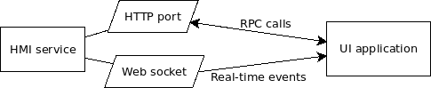

UI development
**************

Basics
======

* To interact with EVA ICS node, use :doc:`/svc/eva-hmi`, which provides HTTP
  (JSON RPC) API

* Real-time events can be taken either from a HMI service web socket from a
  pub/sub server and :doc:`/svc/eva-repl` connected to it.

Web applications
================

There is no standard of JavaScript-interface framework for EVA ICS HMI web
applications. Integrators can choose any UI-framework available or use pure
vanilla-JS.

Data of a web application can have two parts: public and private.

* **public** placed into EVA_DIR/ui, hosted by :doc:`/svc/eva-hmi`, publicly
  available.

* **private** placed into EVA_DIR/pvt, hosted by HMI service using
  :doc:`/hmi/pvt` feature.

Structured data parts can be transformed or language-translated on-the-flow.
See :doc:`/hmi/serve_as` for more details.

:doc:`/hmi/server_templates` can be used to transform other data, such as HTML
pages, on the server side.

.. note::

    It is highly recommended to use `EVA JS Framework
    <https://github.com/alttch/eva-js-framework>`, a JavaScript framework,
    which is used to quickly develop EVA ICS HMI web applications and handles
    authentication, interaction, events and other communication tasks.

Authentication
==============

* Robot applications can use :ref:`API keys <api_key>` to call HTTP RPC
  methods.

* HMI web applications should use :ref:`user accounts <user_account>` and
  call HTTP RPC methods with a :ref:`session tokens <session_token>`.

The model
=========

* An application gets a :ref:`session token <session_token>` using
  :ref:`hmi_http__login` HTTP RPC method.

* The token can be used to call HTTP RPC methods and to subscribe to :ref:`HMI
  web socket <hmi_ws>` to receive real-time events.

* The token can be :ref:`switched to read-only
  mode<hmi_http__session.set_readonly>` for security purposes at any time.

* After the session is over, :ref:`hmi_http__login` HTTP RPC method must be
  called to end the session and destroy the authentication token.

.. note::

    It is highly recommended to use both pull (HTTP RPC
    :ref:`hmi_http__item.state`) and push (web sockets) stategies to handle
    events. Received events can be compared using *ieid* field, more recent
    events always have larger IEIDs.

Handling file uploads
=====================

See :doc:`/hmi/upload`.
